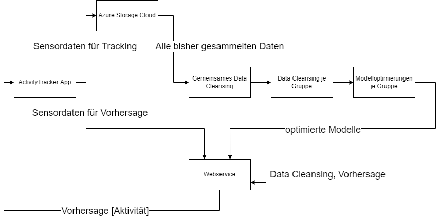

# Challenge Deel Learning 1

Dies ist das Projektrepository der Challange Deep Learning 1 (cdl1).

In dieser Challange wurden Daten der folgenden Aktivitäten gesammelt und klassifiziert.
- Sitzen
- Gehen
- Treppen Steigen
- Lift Fahren
- Laufen
- Fahrrad fahren
- Auto/Bus/Zug fahren

Damit sollen alle Aktivitäten abgedeckt werden, welche wir an einem regulären Arbeitstag nutzen.
Mit den Daten wurden mehrere Machine Learning und Deep Learning Modelle optimiert, um die aktuell ausgeführte Aktivität voraussagen zu können.

## Struktur

| Ordner            | Beschreibung |
|---                | --- |
| ActivityTracker   | Xamarin Android App, um Aktivitäten aufzuzeichnen und diese vorherzusagen. Abgabeprodukt. |
| Analyse           | Data Download und erstes Cleansing, Datengrundlage für die separaten Teams. |
| Group_PB_RS_SL    | Data Cleansing und Modelle Gruppe: Raphael Strebel, Simon Luder und Pascal Berger |
| Group_RS_FM       | Data Cleansing und Modelle Gruppe: Ronny Schneeberger und Flavio Müller |
| webservice        | Server Endpunkt verwendet für das Voraussagen von Aktivitäten. |


## Konzept

Die Challenge cdl1 wurde gemäss dem externen Dokument `Challangevereinbarung.pdf` in einem gemischten Setting bearbeitet. 
Das Sammeln von Daten, das Abgabeprodukt und der Webservice wurde zusammen für alle fünf Personen gemacht.

Das Data Cleaning und das Entwickeln, Optimieren und Evaluieren von Modellen wurde in zwei Einzelgruppen druchgeführt. 
Dafür gibt es in diesem Repository zwei Ordner. 

Die Arbeit von Simon, Raphael und Pascal ist im Ordner `Group_PB_RS_SL` zu finden, die Arbeit von Ronny und Flavio im Ordner `Group_RS_FM`.

## Datenfluss

Für das Sammeln der Aktivitätsdaten, sowie für das Anzeigen der Voraussage von Aktivitäten wird die App `ActivityTracker`, verwendet. Als Datenbasis verwendeten wir `Azure Storage Blobs`, für das Voraussagen von Aktivitäten nutzten wir einen Flask Webservice. Der Datenfluss erfolgte auf folgendem Weg:



## Installation

Für das Einrichten der Xamarin App im Ordner `ActivityTracker` wird Visual Studio benötigt. Für die Einrichtung bitte folgenden Guide befolgen: https://docs.microsoft.com/en-us/xamarin/android/get-started/installation/.

Um die Python Abhängigkeiten der Ordner `Analyse` und `webservice` zu handhaben wurde `pipenv` verwendet. Zur Einrichtung des Environments müssen in einer Konsole folgende Befehle ausgeführt werden:

```
pip install pipenv

pipenv install
```

Die Ordner `Group_PB_RS_SL` und `Group_RS_FM` haben eine eigene Abhängigkeitsorganisation.

### Webservice

Der Webservice für die Vorhersage basiert auf Flask und ist für die Verwendung in Linux gedacht. Um ihn auf Ubuntu 20 aufzusetzen, muss nach der Installation der Python Abhängigkeiten folgendes gemacht werden:

### Einrichten des Systemd Dienstes
```
sudo cp ./webserice/cdl.service /etc/systemd/system/
```
Dabei muss der absolute Pfad des Webservices unter `ExecStart` angepasst werden.

### Starten des Webservices
```
systemctl start cdl
```

### Status des Webservices abfragen
```
systemctl status cdl
```

### Webservices beenden
```
systemctl stop cdl
```

Um den Endpunkt der App anzupassen, muss die Variable `url` der Methode `PostPrediction` unter `./ActivityTracker/ActivityTracker/ActivityTracker/Models/Database.cs` angepasst werden.

